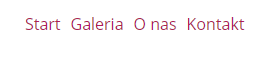
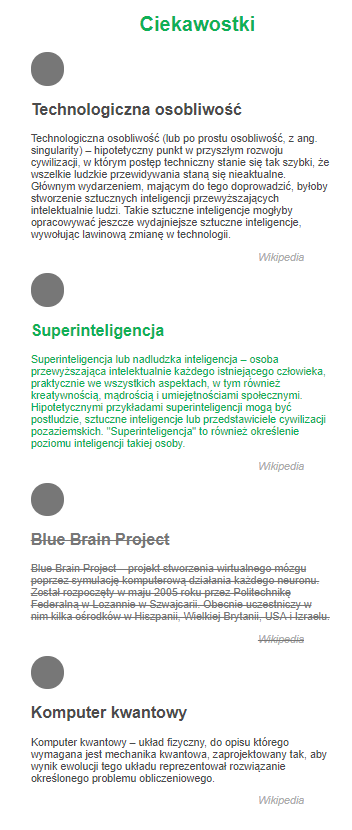
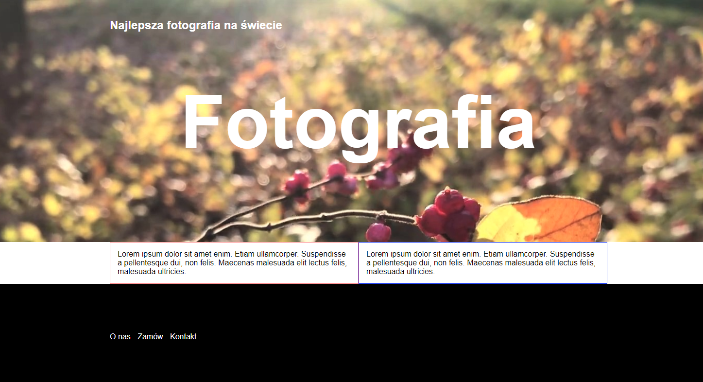
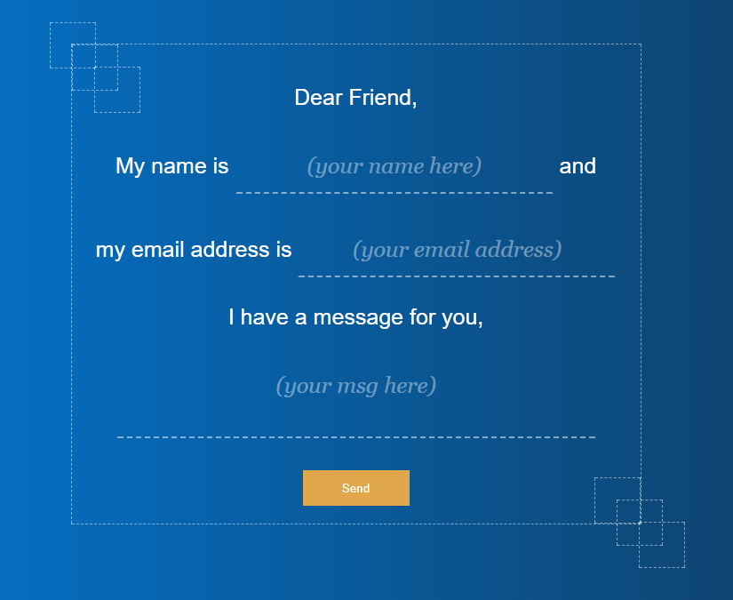

# Zaawansowany HTML i CSS &ndash; egzamin

## Wytyczne dotyczące githuba

1. Stwórz [*fork*](https://guides.github.com/activities/forking/) repozytorium z zadaniami.
2. Sklonuj repozytorium na swój komputer. Użyj do tego komendy `git clone adres_repozytorium`
Adres repozytorium możesz znaleźć na stronie repozytorium po naciśnięciu w guzik "Clone or download".
3. Rozwiąż zadania i skomituj zmiany do swojego repozytorium. Użyj do tego komend `git add nazwa_pliku`.
Jeżeli chcesz dodać wszystkie zmienione pliki użyj `git add .` 
Pamiętaj że kropka na końcu jest ważna!
Następnie skommituj zmiany komendą `git commit -m "nazwa_commita"`
4. Wypchnij zmiany do swojego repozytorium na GitHubie.  Użyj do tego komendy `git push origin master`
5. Stwórz [*pull request*](https://help.github.com/articles/creating-a-pull-request) do oryginalnego repozytorium, gdy skończysz wszystkie zadania.

## Uwagi dotyczące rozwiązywania zadań

Zadania te są testowane za pomocą **specjalnych testów automatycznych**. Zwróć zatem uwagę na następujące rzeczy:
* wcięcia w kodzie,
* nie używaj polskich znaków, staraj się używać języka angielskiego,
* zawsze sprawdzaj, czy Twoje rozwiązanie działa, jeśli powoduje ono błędy nie zostanie ocenione. W takim wypadku lepiej zakomentuj **wrażliwe** części.

---------------------------------------------------------------------

## Zadanie 1

(2 pkt)

Rozwiązując to zadanie, kod HTML wpisuj w pliku ```zadanie01.html``` natomiast CSS w pliku ```css/zadanie01.css```

Twoim zadaniem jest stworzenie menu, według wytycznych poniżej:


**Wytyczne:**
*  Elementy menu muszą być obok siebie;
*  Elementy menu muszą być klikalne;
*  Elementy menu nie powinny mieć podkreślenia
*  Elementy menu powinny mieć kolor:  #B01E57;
*  Czcionka dla wszystkich elementów na stronie powinna być ustawiona jako:  "Open Sans", (Skorzystaj z https://fonts.google.com/)
*  Pamiętaj, aby użyć odpowiednich elementów do stworzenia menu

Tak powinno wyglądać stworzone przez Ciebie menu



## Zadanie 2

(5 pkt)

Rozwiązując to zadanie, **nie zmienaj** nic w pliku ```zadanie02.html```. 
Swój kod wpisuj **wyłącznie** w pliku ```css/zadanie02.css```

Otwórz plik ```zadanie02.html``` w przeglądarce i przyjrzyj się stronie. Znajduje się tam kilka artykułów. 

* w drugim artykule ustaw dla nagłówka oraz tekstu kolor czcionki #1db954
* w trzecim artukule ustaw przekreślenie dla nagłówka, tekstu oraz źródła   
* ustaw nad każdym artykułem element w postaci kółka. Niech kółko ma następujące właściwości:
    * wysokość i szerokość: 50px
    * kolor tła: grey

**Wytyczne:**
- Nie zmieniaj kodu HTML
- Nie korzystaj z !important

Tak powinna wyglądać strona po wprowadzonych przez Ciebie zmianach.



## Zadanie 3

(10 pkt)

Rozwiązując to zadanie możesz modyfikować kod HTML z pliku  ```zadanie03.html```, dopisując klasy do odpowiednich elementów.
Kod CSS umieść w pliku ```css/zadanie03.css```

Twoim zadaniem jest stworzyć minimalistyczny szablon strony zgodnie z poniższymi wytycznymi.
Przyjrzyj się również obrazkowi poniżej, będzie Ci łatwiej zrozumieć polecenia. Staraj się odwzorować ten template zgodnie z wytycznymi:

* Stwórz klasę ```center```, której zadaniem będzie środkowanie strony. Klasę tę ostylu w kodzie CSS w taki sposób, żeby środkowała stronę o szerokości ```1024px```. Dodaj klasę ```center``` do odpowiednich tagów w kodzie HTML. Dobrze zastanów się do jakich;
* Ustaw czcionkę dla całej strony na Arial i zresetuj podstawowe style;
* Wczytaj obrazek o nazwie ```zadanie03.jpg``` do elementu o ```id``` ```mainBackground```;
* Tekst "Fotografia" ustaw na środku kontenera, w którym jest (wyśrodkuj tylko w poziomie). Ustaw mu kolor biały i wielkość czcionki 150px;
* Pod elementem ```header``` znajduje się sekcja, a w niej dwa artykuły. Ustaw je obok siebie;
* Stopkę ostyluj w taki sposób, aby miała czarne tło, była rozciągnięta na 100% szerkości przeglądarki, a lista, która jest wewnątrz niej przylegała do **lewej krawędzi** środka strony. (Tak jak na zdjęciu poniżej)

Postaraj się odwzorować stronę jak najlepiej.

Tak powinna wyglądać strona po wprowadzonych przez Ciebie zmianach.



## Zadanie 4

(3 pkt)

Rozwiązując to zadanie, **nie zmienaj** nic w pliku ```zadanie04.html```. 
Swój kod wpisuj **wyłącznie** w pliku ```css/zadanie04.css```

Twoim zadaniem jest ustawić odpowiednio sześć kwadratów.
Przyjrzyj się rysunkowi poniżej, będzie Ci łatwiej zrozumieć jak masz je ustawić. Wytyczne, które trochę pomogą:

* Szerokość i wysokość każdego kwadratu to 50px;
* Obramowanie jest dokładnie takie samo jak formularza czyli: 1px dashed rgba(255, 255, 255, 0.5);


